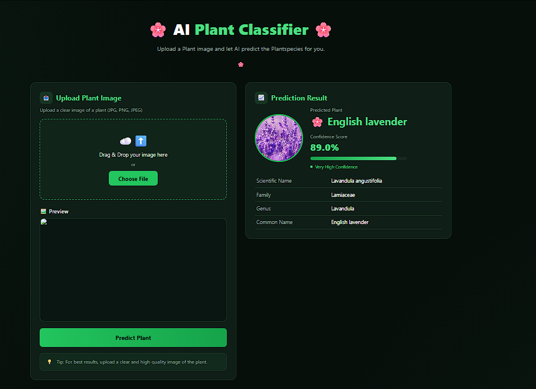
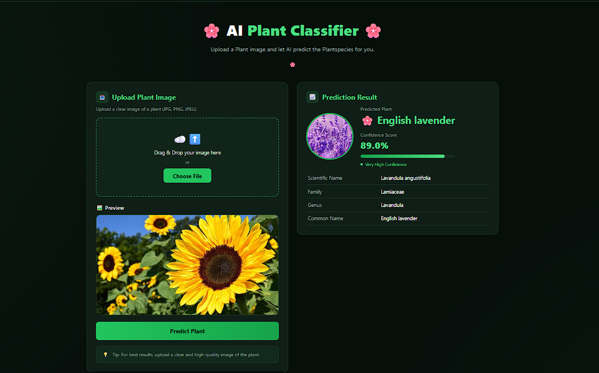
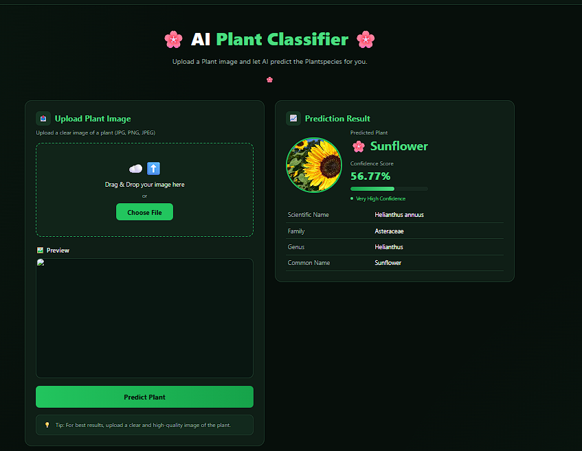
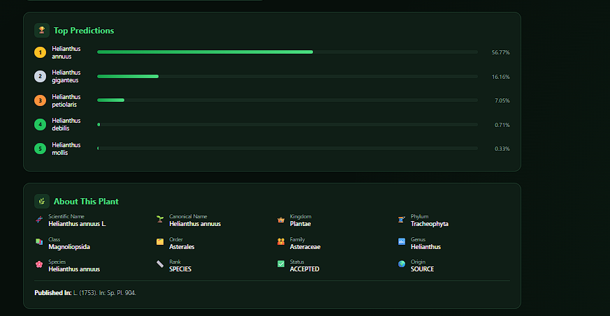

# 🌿 PlantLens AI - Intelligent Plant Identification System

PlantLens AI is a Flask-based web application that identifies plants from uploaded images using the PlantNet API. The application predicts the most likely plant species and displays detailed botanical information such as scientific name, family, genus, confidence score, and multiple prediction results.

## ✨ Features

* 🌸 Plant Identification using PlantNet API
* 🍃 Supports flowers, leaves, fruits, bark and other plant parts
* 📷 Drag & Drop Image Upload
* 🖼️ Image Preview
* 📊 Confidence Score
* 🌿 Scientific Name
* 🧬 Family & Genus Information
* 🔍 Top 5 Predictions
* 🌍 GBIF Integration for Biodiversity Information
* 💻 Responsive Modern UI
* ⚡ Built with Flask

---

## 🛠️ Technologies Used

* Python 3.12
* Flask
* HTML5
* CSS3
* JavaScript
* PlantNet API
* GBIF API
* Requests
* Werkzeug

---

## 📂 Project Structure

```text
PlantLensAI/
│
├── app.py
├── plantnet_api.py
├── gbif_api.py
├── requirements.txt
├── README.md
│
├── templates/
│   └── index.html
│
├── uploads/
│
└── static/
```

---

## 🚀 Installation

Clone the repository

```bash
git clone https://github.com/your-username/PlantLensAI.git
```

Go to project folder

```bash
cd PlantLensAI
```

Create virtual environment

```bash
python -m venv venv
```

Activate virtual environment

### Windows

```bash
venv\Scripts\activate
```

### Linux / macOS

```bash
source venv/bin/activate
```

Install dependencies

```bash
pip install -r requirements.txt
```

Run the application

```bash
python app.py
```

Open your browser

```
http://127.0.0.1:5000
```
## 📷 Screenshots
<p align="center">
  
</p>
<p align="center">
  
</p>
<p align="center">
  
</p>
<p align="center">
  
</p>
---

## 📸 How It Works

1. Upload an image of a plant.
2. The image is sent to the PlantNet API.
3. PlantNet analyzes the image.
4. The best prediction is selected.
5. Plant details are displayed.
6. Additional biodiversity information is fetched from GBIF.

---

## 📈 Future Improvements

* Wikipedia Integration
* Disease Detection
* Plant Care Tips
* Medicinal Uses
* Water Requirement Prediction
* AI Chatbot for Plants
* Multi-language Support
* Camera Capture
* Dark/Light Theme
* User Accounts & History

---


---

## 👨‍💻 Author

**Gurlal Singh**

B.Tech Artificial Intelligence & Data Science

---

## 📄 License

This project is developed for educational and portfolio purposes.
